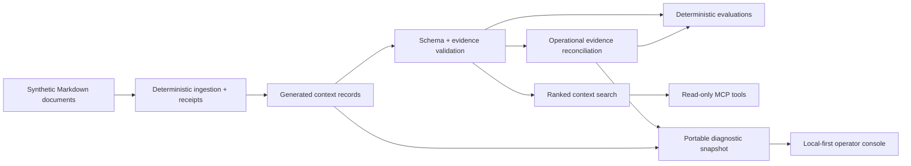

# Context Layer Lab

A small, inspectable reference implementation for preventing AI agents from
acting on stale operational context.

The primary demonstration asks a simple question: **are all scheduled
automations healthy?** An earlier dashboard says yes. Newer terminal receipts
show that one run failed and another produced work that was never integrated.
A summary-only system answers incorrectly; the context layer reconciles
freshness, schedule state, and evidence specificity before answering.

**[Open the local-first diagnostic](https://kaagemusha.github.io/context-layer-lab/)**

## The Failure It Prevents

```text
07:30  fleet dashboard: GREEN
08:02  morning brief: SUCCESS
08:40  site refresh: FAILED
09:05  research watch: PRESERVED_LOCAL

Naive answer:     Yes, the dashboard is green.
Governed answer: No, two lanes need attention.
```

The scenario is synthetic and public-safe, but the failure class is real:
aggregate status commonly outlives the evidence it summarizes.

The implementation demonstrates that:

- newer terminal receipts override an expired aggregate;
- a not-yet-due lane is not mislabeled as failed;
- `PRESERVED_LOCAL` is not confused with successful integration;
- every conclusion links to a typed evidence record;
- malformed, unsupported, missing, and stale context fail visibly;
- search uses bounded BM25F ranking rather than unbounded term counts;
- the full replay and evaluation are deterministic and require no model call.

This is not a RAG benchmark, vector database, production authorization layer,
or claim that schema validation makes information true. It demonstrates the
smaller evidence-reconciliation layer that should exist before an agent is
trusted to summarize operational state.

## Quick Start

Requires Node.js 22 or newer.

```bash
npm install
npm run check
npm start
```

Generate a portable diagnostic snapshot:

```bash
npm run diagnose -- --output snapshot.json
```

The live console can open this file directly. Parsing and rendering happen in
the browser; the file is not uploaded, persisted, or sent to an analytics
service. Use `--scenario` and `--records` to point the command at another
compatible evidence set:

```bash
npm run diagnose -- \
  --scenario path/to/scenario.json \
  --records path/to/context-records.json \
  --output snapshot.json
```

The public console loads a synthetic sample by default. A private operator can
open a locally generated snapshot, inspect only the evidence that affected the
answer, and copy a bounded status report.

### Trajectory adapter

The included adapter accepts the vault's compact `trajectory-run-v1` shape and
turns declared lanes, run end states, and evidence summaries into the same
diagnostic packet. The example is synthetic; it demonstrates the mapping
without publishing vault paths or operational data.

```bash
npm run adapt:trajectory -- \
  --input examples/trajectory-adapter-input.json \
  --output snapshot.json
```

| Trajectory field | Diagnostic field |
|---|---|
| `task.lane` | scheduled lane |
| `ended_at` | terminal observation time |
| `result.state` | success, failed, or preserved-local outcome |
| `result.summary` | evidence-backed claim and record content |
| `summary.validUntil` | explicit aggregate freshness boundary |

Unknown or partial end states map to `preserved_local`, which requires
attention rather than being promoted to success. Real inputs remain local.

Add the compiled stdio server to an MCP client:

```json
{
  "mcpServers": {
    "context-layer-lab": {
      "command": "node",
      "args": ["/absolute/path/to/context-layer-lab/dist/src/server.js"]
    }
  }
}
```

## MCP Tools

| Tool | Purpose |
|---|---|
| `search_context` | Return up to 5 ranked matches by default, capped at 20, with quality flags and source IDs. |
| `explain_source` | Show one source and the exact claims it supports. |
| `inspect_ingestion` | Trace one record to its Markdown document and content hash. |
| `validate_record` | Validate an arbitrary record against the schema and evidence rules. |

All tools are read-only. They do not generate answers, mutate records, or call
external services.

## Retrieval

`search_context` uses BM25F with per-field length normalization, inverse
document frequency, and term-frequency saturation. Titles and tags outweigh
free text. Whole-token matching prevents `out` from matching `rollout`;
stopword removal prevents a query such as `the` from producing false
confidence. Nine retrieval evaluations keep those properties, result bounds,
and visible quality states from silently regressing.

## Data Contract

Each record includes:

```text
identity -> id, title, summary, tags
accountability -> owner, updatedAt, validUntil
evidence -> sources[]
claims -> text + sourceIds[]
```

The canonical public fixtures are the Markdown documents in
[`fixtures/source-docs`](fixtures/source-docs). `npm run ingest` generates
[`data/context-records.json`](data/context-records.json) and
[`data/ingestion-receipts.json`](data/ingestion-receipts.json). Receipts use
source-relative paths, byte counts, and content hashes rather than a wall-clock
ingestion time, so the same source produces the same output.

[`data/snapshot-metadata.json`](data/snapshot-metadata.json) declares the
moment this pinned dataset describes. MCP calls without an explicit `asOf`
evaluate at that declared time; callers can still override it, and datasets
without a declaration fall back to wall-clock time. A monthly advisory opens
an issue when the public sample ages past its stated threshold.

`src/diagnostic-snapshot.ts` packages one scenario, its deterministic
assessment, and only the evidence records that affected that assessment.
`npm run demo:sync` generates the public synthetic snapshot; CI fails if it
drifts.

## Evaluations

`npm run eval` checks six validation and operational cases:

1. valid context
2. stale context
3. missing provenance
4. unsupported claim
5. malformed record
6. a stale healthy dashboard contradicted by newer run receipts

The record cases live in [`evals/cases.json`](evals/cases.json); the operational
replay lives in
[`evals/operational-health.json`](evals/operational-health.json). A case passes
only when the observed result exactly matches the expected result.

It then runs nine independent retrieval cases from
[`evals/retrieval-cases.json`](evals/retrieval-cases.json). Validation asks
whether a record is correctly described; retrieval asks whether search returns
the right bounded evidence. Both need to pass.

## Architecture



The core is intentionally independent from MCP and the browser.
`src/context.ts` owns validation and search; `src/operational-health.ts` owns
the reconciliation rule; `src/diagnostic-snapshot.ts` creates the portable
boundary; `src/tool-handlers.ts` converts context operations into stable tool
results; `src/server.ts` is only the protocol adapter.

## Design Decisions

**Structured lexical retrieval over embeddings.** The dataset is tiny, and the
proof concerns provenance and freshness rather than semantic-retrieval quality.
Adding embeddings would introduce network, model, and nondeterminism without
testing the central claim.

**Warnings travel with retrieval results.** Silently excluding stale records
can erase useful history. Returning a visible quality state lets the caller
decide whether degraded context is acceptable.

**No automatic truth score.** Source coverage is measurable; truth is not.
The validator reports whether claims are linked to declared evidence, not
whether the evidence is correct.

**JSON front matter over another parser dependency.** The fixtures are
Markdown, while machine-readable identity and evidence remain strict JSON.
This keeps ingestion deterministic and the dependency surface small.

**One public-safe fixture set.** No client data, private knowledge-base
structure, credentials, or operating logs are included. The organizations and
URLs are fictional.

## What This Lab Caught in Itself

The lab has failed on the same boundaries it is designed to make visible:

- Its pinned fixture story originally drifted with wall-clock time. Snapshot
  metadata now declares the fixture time, CI checks coherence at that declared
  time, and a monthly advisory reports real-world aging without making a
  permanent red build inevitable.
- Its first browser console trusted the assessment included in an imported
  snapshot. It now validates the shared strict schemas, recomputes the
  assessment from the scenario and evidence records, and rejects any mismatch.

The time precedence is explicit input, then declared snapshot time, then wall
clock. Regression tests preserve both corrections. The point is not that the
lab avoided mistakes; it is that each discovered failure became a testable
constraint.

## Repository Map

```text
data/             generated records and ingestion receipts
docs/             dependency-free local-first diagnostic
evals/            deterministic evaluation cases
fixtures/         canonical synthetic Markdown sources
examples/         public-safe adapter inputs
src/context.ts    schema, validation, and search
src/diagnostic-snapshot.ts
src/ingest.ts     Markdown ingestion and deterministic receipts
src/operational-health.ts
src/server.ts     stdio MCP adapter
src/tool-handlers.ts
test/             unit and contract tests
```

## Limits and Next Tests

- Authorization and record-level access control are out of scope.
- The operational scenario is a narrow deterministic policy, not a universal
  incident-management engine.
- Recency is based on an explicit `validUntil`, not inferred from content.
- Source URLs are identifiers in this lab; the validator does not fetch them.
- BM25F remains lexical by design; add embeddings only when a larger corpus and
  retrieval evaluations demonstrate the need.
- A production system would add signed changes, access policy, observability,
  and human correction workflows.

## Development

```bash
npm run typecheck
npm test
npm run eval
npm run eval:retrieval
npm run ingest:check
npm run fixture:check
npm run demo:check
```

The project uses the stable MCP TypeScript SDK v1 API and follows the official
stdio server pattern.
