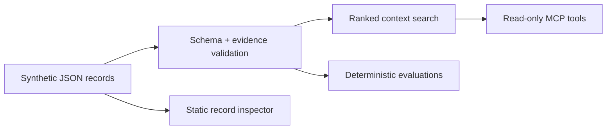

# Context Layer Lab

A small, inspectable reference implementation for a problem that appears in
almost every serious AI deployment: the model is capable, but the context
around it is stale, unsupported, or impossible to audit.

The lab stores synthetic organizational records with explicit ownership,
freshness windows, sources, and claim-to-source links. It exposes the records
through three read-only MCP tools and tests the failure modes directly.

**[Open the live record inspector](https://kaagemusha.github.io/context-layer-lab/)**

## What It Demonstrates

- A context record has a schema, an owner, a freshness boundary, and sources.
- Every claim identifies the sources that support it.
- Retrieval returns quality flags with the result instead of hiding them.
- Validation distinguishes malformed data, missing provenance, stale context,
  and unsupported claims.
- Ranking is BM25F, so a term's weight reflects how rare and how load-bearing
  it is rather than how often it appears. See [Ranking](#ranking).
- Evaluations are deterministic and run in CI without a model call, and cover
  retrieval quality as well as validation.
- A read-only browser makes the same synthetic records easy to inspect.

This is not a RAG benchmark, vector database, production authorization layer,
or claim that schema validation makes information true. It demonstrates the
smaller layer that should exist before those systems are trusted.

## Quick Start

Requires Node.js 22 or newer.

```bash
npm install
npm run check
npm start
```

Add the compiled stdio server to an MCP client:

```json
{
  "mcpServers": {
    "context-layer-lab": {
      "command": "node",
      "args": ["/absolute/path/to/context-layer-lab/dist/src/server.js"]
    }
  }
}
```

## MCP Tools

| Tool | Purpose |
|---|---|
| `search_context` | Search records and return a bounded, ranked set with quality flags and source IDs. Accepts an optional `limit` (default 5, capped at 20). |
| `explain_source` | Show one source and the exact claims it supports. |
| `validate_record` | Validate an arbitrary record against the schema and evidence rules. |

All tools are read-only. They do not generate answers, mutate records, or call
external services.

## Ranking

`search_context` scores with **BM25F** — per-field length normalization,
inverse document frequency, and term-frequency saturation applied once to the
combined score:

```
tf~_f  = tf_f / (1 - b + b * len_f / avglen_f)     per field
pseudo = Σ_f  w_f * tf~_f                          weighted sum
score  = idf * pseudo / (k1 + pseudo)              saturate once
```

Field weights are title 5, tags 4, summary 3, content 1, claims 1 — curated
fields outrank free text.

Results are bounded: `search_context` returns 5 matches by default and never
more than 20. A retrieval tool serving an agent should hand back a ranked set
whose length tracks relevance, not corpus size. The effective limit is echoed
back in the response so a caller can distinguish a truncated result set from an
exhaustive one.

This replaced a weighted term-count scorer. That approach is a reasonable first
pass and it had three defects worth naming. Each was reproduced against this
repository's own three-record corpus before the fix — they were observable
here, not hypothetical. They are simply easy to miss in a small corpus unless
something checks for them:

| Defect | Symptom | Fix |
|---|---|---|
| Substring matching | Query `out` matched a record containing `rollout` | Whole-token extraction |
| No IDF or stopword handling | Query `the` returned a confident ranking | Smoothed RSJ IDF plus stopword removal |
| No saturation or length normalization | A record repeating a term 40 times scored 40× | BM25F saturation and per-field normalization |

Each defect has a corresponding case in `evals/retrieval-cases.json`, so a
regression fails CI rather than silently degrading result quality.

One caveat stated plainly: the smoothed IDF `log(1 + (N-df+0.5)/(df+0.5))`
stays positive by construction — the `+1` is what prevents the negative scores
the unsmoothed form produces once a term appears in more than half the corpus.
So a term in *every* record is heavily discounted but not zeroed. Stopword
removal, not IDF, is what makes a query of `the` return nothing.

## Data Contract

Each record includes:

```text
identity -> id, title, summary, tags
accountability -> owner, updatedAt, validUntil
evidence -> sources[]
claims -> text + sourceIds[]
```

The canonical public fixture is
[`data/context-records.json`](data/context-records.json). The browser copy is
generated by `npm run demo:sync`; CI fails if it drifts.

## Evaluations

`npm run eval` runs two independent suites covering two different failure
surfaces.

**Validation** — is a record correctly *described*? Five cases in
[`evals/cases.json`](evals/cases.json):

1. valid context
2. stale context
3. missing provenance
4. unsupported claim
5. malformed record

A case passes only when the observed issue codes exactly match the expected
codes.

**Retrieval** — does search return the *right thing*? Nine cases in
[`evals/retrieval-cases.json`](evals/retrieval-cases.json), each carrying a
`why` field explaining the failure it guards against:

1. whole-token matching (`out` must not match `rollout`)
2. stopwords carry no signal
3. a distinctive term outranks a common one
4. a title match beats a body match
5. an empty query returns nothing
6. an unmatched term returns nothing
7. quality flags travel with every result
8. results are bounded by the default limit
9. an oversized `limit` is capped rather than honoured

These two are deliberately separate. A record can be perfectly valid and still
be unfindable, and a search can rank correctly while surfacing stale context.
Testing one does not test the other.

Run them individually with `npm run eval:retrieval`.

## Architecture



The core is intentionally independent from MCP. `src/context.ts` owns
validation and search; `src/tool-handlers.ts` converts those operations into
stable tool results; `src/server.ts` is only the protocol adapter.

## Design Decisions

**Structured lexical retrieval over embeddings.** The dataset is tiny, and the
proof concerns provenance and freshness rather than semantic-retrieval quality.
Adding embeddings would introduce network, model, and nondeterminism without
testing the central claim.

**Warnings travel with retrieval results.** Silently excluding stale records
can erase useful history. Returning a visible quality state lets the caller
decide whether degraded context is acceptable.

**No automatic truth score.** Source coverage is measurable; truth is not.
The validator reports whether claims are linked to declared evidence, not
whether the evidence is correct.

**One public-safe fixture.** No client data, private knowledge-base structure,
credentials, or operating logs are included. The organizations and URLs are
fictional.

## Repository Map

```text
data/             canonical synthetic records
docs/             dependency-free read-only inspector
evals/            deterministic evaluation cases
src/context.ts    schema, validation, and search
src/server.ts     stdio MCP adapter
src/tool-handlers.ts
test/             unit and contract tests
```

## Limits and Next Tests

- Authorization and record-level access control are out of scope.
- Recency is based on an explicit `validUntil`, not inferred from content.
- Source URLs are identifiers in this lab; the validator does not fetch them.
- Lexical ranking is intentionally simple and should be replaced only when a
  larger corpus demonstrates the need.
- A production system would add signed changes, source ingestion receipts,
  access policy, observability, and human correction workflows.

## Development

```bash
npm run typecheck
npm test
npm run eval
npm run demo:check
```

The project uses the stable MCP TypeScript SDK v1 API and follows the official
stdio server pattern.
