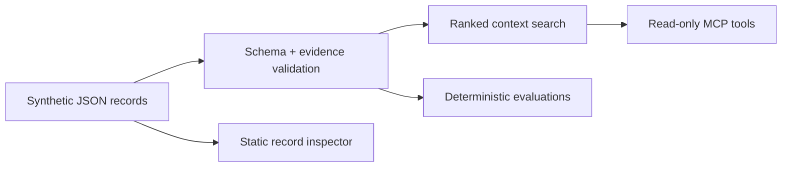

# Context Layer Lab

A small, inspectable reference implementation for a problem that appears in
almost every serious AI deployment: the model is capable, but the context
around it is stale, unsupported, or impossible to audit.

The lab stores synthetic organizational records with explicit ownership,
freshness windows, sources, and claim-to-source links. It exposes the records
through three read-only MCP tools and tests the failure modes directly.

## What It Demonstrates

- A context record has a schema, an owner, a freshness boundary, and sources.
- Every claim identifies the sources that support it.
- Retrieval returns quality flags with the result instead of hiding them.
- Validation distinguishes malformed data, missing provenance, stale context,
  and unsupported claims.
- Evaluations are deterministic and run in CI without a model call.
- A read-only browser makes the same synthetic records easy to inspect.

This is not a RAG benchmark, vector database, production authorization layer,
or claim that schema validation makes information true. It demonstrates the
smaller layer that should exist before those systems are trusted.

## Quick Start

Requires Node.js 22 or newer.

```bash
npm install
npm run check
npm start
```

Add the compiled stdio server to an MCP client:

```json
{
  "mcpServers": {
    "context-layer-lab": {
      "command": "node",
      "args": ["/absolute/path/to/context-layer-lab/dist/src/server.js"]
    }
  }
}
```

## MCP Tools

| Tool | Purpose |
|---|---|
| `search_context` | Search records and return ranked matches with quality flags and source IDs. |
| `explain_source` | Show one source and the exact claims it supports. |
| `validate_record` | Validate an arbitrary record against the schema and evidence rules. |

All tools are read-only. They do not generate answers, mutate records, or call
external services.

## Data Contract

Each record includes:

```text
identity -> id, title, summary, tags
accountability -> owner, updatedAt, validUntil
evidence -> sources[]
claims -> text + sourceIds[]
```

The canonical public fixture is
[`data/context-records.json`](data/context-records.json). The browser copy is
generated by `npm run demo:sync`; CI fails if it drifts.

## Evaluations

`npm run eval` checks five explicit cases:

1. valid context
2. stale context
3. missing provenance
4. unsupported claim
5. malformed record

The cases live in [`evals/cases.json`](evals/cases.json). A case passes only
when the observed issue codes exactly match the expected codes.

## Architecture



The core is intentionally independent from MCP. `src/context.ts` owns
validation and search; `src/tool-handlers.ts` converts those operations into
stable tool results; `src/server.ts` is only the protocol adapter.

## Design Decisions

**Structured lexical retrieval over embeddings.** The dataset is tiny, and the
proof concerns provenance and freshness rather than semantic-retrieval quality.
Adding embeddings would introduce network, model, and nondeterminism without
testing the central claim.

**Warnings travel with retrieval results.** Silently excluding stale records
can erase useful history. Returning a visible quality state lets the caller
decide whether degraded context is acceptable.

**No automatic truth score.** Source coverage is measurable; truth is not.
The validator reports whether claims are linked to declared evidence, not
whether the evidence is correct.

**One public-safe fixture.** No client data, private knowledge-base structure,
credentials, or operating logs are included. The organizations and URLs are
fictional.

## Repository Map

```text
data/             canonical synthetic records
docs/             dependency-free read-only inspector
evals/            deterministic evaluation cases
src/context.ts    schema, validation, and search
src/server.ts     stdio MCP adapter
src/tool-handlers.ts
test/             unit and contract tests
```

## Limits and Next Tests

- Authorization and record-level access control are out of scope.
- Recency is based on an explicit `validUntil`, not inferred from content.
- Source URLs are identifiers in this lab; the validator does not fetch them.
- Lexical ranking is intentionally simple and should be replaced only when a
  larger corpus demonstrates the need.
- A production system would add signed changes, source ingestion receipts,
  access policy, observability, and human correction workflows.

## Development

```bash
npm run typecheck
npm test
npm run eval
npm run demo:check
```

The project uses the stable MCP TypeScript SDK v1 API and follows the official
stdio server pattern.
