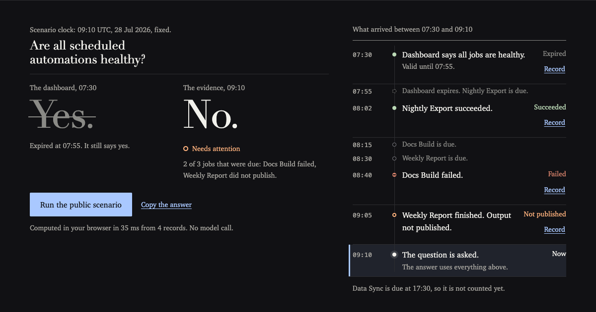

# Context Layer Lab

[](https://github.com/Kaagemusha/context-layer-lab/actions/workflows/ci.yml)


[](https://kaagemusha.github.io/context-layer-lab/)

A small, inspectable reference implementation for stopping AI agents from
acting on stale operational context.

**[Open the local-first diagnostic](https://kaagemusha.github.io/context-layer-lab/)**:
no install, loads a synthetic snapshot, fully interactive.

## The failure it prevents

```text
07:30  status dashboard: GREEN (valid until 07:55)
08:02  nightly export: SUCCESS
08:40  docs build: FAILED
09:05  weekly report: finished, output not published
17:30  data sync: due later today, not counted as failed

Naive answer:     Yes, the dashboard is green.
Governed answer:  No, two lanes need attention.
```

The scenario is synthetic and public-safe, but the failure class is real:
aggregate status commonly outlives the evidence it summarizes. This lab
reconciles freshness, schedule state, and evidence specificity before it will
answer "are all scheduled automations healthy?" It does not simply repeat
whatever the last dashboard said.

## What this proves

- **BM25F freshness-aware retrieval: 10/10 cases correct.** Current records
  rank above stale and invalid ones; BM25F score orders records within each
  state. Whole-token, quality-flagged, bounded search, no embeddings. Full
  numbers, including a three-way naive vs. recency-only vs. governed
  contrast, in [`docs/eval-report.md`](docs/eval-report.md).
- **Newer terminal receipts override an expired aggregate**, and a not-yet-due
  lane is never mislabeled as failed (see the operational invariant matrix in
  [`docs/architecture.md`](docs/architecture.md#operational-invariant-matrix)).
- **Every decision-bearing summary, receipt, and lane schedule is bound to a
  source-linked typed assertion.** A scenario outcome that contradicts its own
  evidence is rejected, not silently trusted.
- **17 deterministic cases pass against the real reconciliation and retrieval
  code**, no model call: `npm run eval` (7 record and operational, 10
  retrieval).

This is not a RAG benchmark, vector database, or production authorization
layer, and it does not claim schema validation makes information true. It is
the smaller evidence-reconciliation layer that should exist before an agent is
trusted to summarize operational state.

## Quick start

Requires Node.js 22+.

```bash
npm install
npm run check
npm run demo
```

`npm run demo` prints the scenario above from the real reconciliation code:

```text
Question: Are all scheduled automations healthy?
As of:    2026-07-28T09:10:00Z

Naive answer:    healthy. It repeats the dashboard observed at 2026-07-28T07:30:00Z.
Governed answer: attention. 2 of 3 due lanes need attention.

Why:
- The dashboard record is stale. The record expired at 2026-07-28T07:55:00Z.
- 3 newer run receipts supersede it.
- Docs Build: failed (docs-build-receipt).
- Weekly Report: preserved_local (weekly-report-receipt).
- Data Sync: not due yet, so it is not counted as failed.
```

`npm start` starts the read-only MCP server on stdio. It prints nothing and
waits for a client; see [MCP tools](docs/architecture.md#mcp-tools) for the
client config.

To apply the pattern to a company knowledge base, see
[`docs/how-to-adopt.md`](docs/how-to-adopt.md#apply-it-to-a-company-knowledge-base).

Generate a portable diagnostic snapshot the console can open directly.
Parsing and rendering happen in the browser; nothing is uploaded:

```bash
npm run diagnose -- --output snapshot.json
```

## Two labs, one boundary

```text
Context Layer Lab   ->  diagnose        what current evidence supports
Governed Action Lab ->  prepare/approve what may execute, under whose authority
                    ->  execute/verify  with what receipt
```

This lab establishes what current evidence supports. Its companion,
[Governed Action Lab](https://github.com/Kaagemusha/governed-action-lab)
([live console](https://kaagemusha.github.io/governed-action-lab/)), starts at
that boundary and decides what may execute, under whose authority,
and with what receipt. They are one system in two repos, not two unrelated
projects. The real command sequence between them, with real output, is in
[governed-action-lab's `docs/pair-walkthrough.md`](https://github.com/Kaagemusha/governed-action-lab/blob/main/docs/pair-walkthrough.md).

## Scope and limits

**Status: reference implementation, not a production system.** This
repository demonstrates governed context records, provenance, validity
windows, freshness-aware retrieval, and a naive-versus-governed failure
contrast. It does not compete with production context or memory platforms on
retrieval scale, storage architecture, access control, or poisoning defense.
Authorization and record-level access control are out of scope; recency comes
from an explicit `validUntil`, not inferred content. See
[`docs/architecture.md`](docs/architecture.md#limits-and-next-tests) for the
full list.

## Learn more

- [`docs/architecture.md`](docs/architecture.md): MCP tools, retrieval, data
  contract, evaluations, adapters, and full development checks.
- [`docs/eval-report.md`](docs/eval-report.md): auto-generated numbers and the
  naive/recency-only/governed contrast.
- [`docs/adr/`](docs/adr/): six architecture decision records.
- [`docs/how-to-adopt.md`](docs/how-to-adopt.md): how to put this pattern in
  front of a real agent, and what production still needs.
- [`CONTRIBUTING.md`](CONTRIBUTING.md): development checks and how to add an
  eval case.

## How it was built

Built with Claude Code and Codex under my direction. I set the design and
approve every release; the two agents wrote and cross-reviewed much of the
code. Every change passes CI and review before release.

## License

MIT
