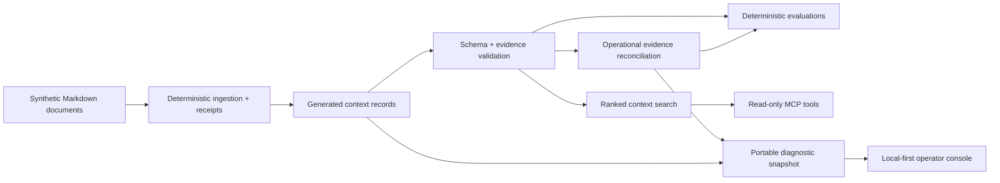

# Architecture

Full technical reference for Context Layer Lab. The [README](../README.md)
covers the overview and quick start; this document covers how it works.

## Diagram



The core is intentionally independent from MCP and the browser.
`src/context.ts` owns validation and search; `src/operational-health.ts` owns
the reconciliation rule; `src/diagnostic-snapshot.ts` creates the portable
boundary; `src/tool-handlers.ts` converts context operations into stable tool
results; `src/server.ts` is only the protocol adapter.

## MCP tools

| Tool | Purpose |
|---|---|
| `search_context` | Return up to 5 ranked matches by default, capped at 20, current records first, with quality flags and source IDs. |
| `explain_source` | Show one source and the exact claims it supports. |
| `inspect_ingestion` | Trace one record to its Markdown document and content hash. |
| `validate_record` | Validate an arbitrary record against the schema and evidence rules. |

All tools are read-only. They do not generate answers, mutate records, or call
external services.

Add the compiled stdio server to an MCP client:

```json
{
  "mcpServers": {
    "context-layer-lab": {
      "command": "node",
      "args": ["/absolute/path/to/context-layer-lab/dist/src/server.js"]
    }
  }
}
```

## Retrieval

`search_context` uses BM25F with per-field length normalization, inverse
document frequency, and term-frequency saturation. Titles and tags outweigh
free text. Whole-token matching prevents `out` from matching `rollout`;
stopword removal prevents a query such as `the` from producing false
confidence.

Ranking is freshness-aware. Results sort first by validation state, then by
BM25F score, then by title, then by record ID, so equal scores never depend
on input order. `valid` records (no issues) come first,
`degraded` records (past `validUntil`, no evidence errors) next, and
`invalid` records (missing provenance or unsupported claims) last. A stale
record that matches the query best still ranks below a current one, and it
is returned with its state rather than dropped. Ten retrieval evaluations
keep those properties, result bounds, and visible quality states from
silently regressing.

## Data contract

Each record includes:

```text
identity -> id, title, summary, tags
accountability -> owner, updatedAt, validUntil
evidence -> sources[]
claims -> text + sourceIds[] + optional typed operational assertion
```

The canonical public fixtures are the Markdown documents in
[`fixtures/source-docs`](../fixtures/source-docs). `npm run ingest` generates
[`data/context-records.json`](../data/context-records.json) and
[`data/ingestion-receipts.json`](../data/ingestion-receipts.json). Receipts use
source-relative paths, byte counts, and content hashes rather than a wall-clock
ingestion time, so the same source produces the same output.

[`data/snapshot-metadata.json`](../data/snapshot-metadata.json) declares the
moment this pinned dataset describes. MCP calls without an explicit `asOf`
evaluate at that declared time; callers can still override it, and datasets
without a declaration fall back to wall-clock time. A monthly advisory opens
an issue when the public sample ages past its stated threshold, unless an
explicit `retention` (an expiry date and a reason) is in force; once it lapses
the advisory fires again.

`src/diagnostic-snapshot.ts` packages one scenario, its deterministic
assessment, and only the evidence records that affected that assessment.
`npm run demo:sync` generates the public synthetic snapshot; CI fails if it
drifts.

Diagnostic snapshots use `context-layer-diagnostic/v2`. Version 2 binds each
operational summary, receipt, and declared lane schedule to typed assertions on
its evidence records. The operational claim must identify a declared source
with the same observation time. Any mismatch in verdict, coverage, due time,
lane, outcome, or observation time is rejected. Version 1 snapshots cannot
prove that binding and are therefore rejected with an instruction to regenerate
them; they are not silently upgraded.

The typed assertion is authoritative for deterministic reconciliation. Record
summary, content, and claim prose remain human-readable explanation; this lab
does not pretend to infer whether arbitrary prose is semantically equivalent to
the typed value.

### Operational invariant matrix

The reconciler treats ambiguity as invalid input rather than choosing an
answer from array order or future evidence.

| Boundary | Invariant | Failure behavior | Executable proof |
|---|---|---|---|
| Identity | Source IDs are unique within a record; lane IDs, receipt record IDs, and context record IDs are unique within an assessment. | Reject before reconciliation. | `context.test.ts`, `ingest.test.ts`, `operational-health.test.ts` |
| References | Every claim source exists, every receipt names a declared lane, and every decision-bearing record exists. | Reject as unsupported, unknown, or missing. | `context.test.ts`, `operational-health.test.ts` |
| Evidence binding | Summary, schedule, receipt, outcome, and observation time exactly match one source-linked typed assertion. | Reject the scenario/record mismatch. | `operational-health.test.ts`, `diagnostic-snapshot.test.ts` |
| Time | A summary cannot postdate `asOf`; later receipts may remain in a historical packet but cannot affect its decision. | Reject a future summary; ignore later receipts for that point-in-time verdict. | `operational-health.test.ts` boundary and future-receipt tests |
| Ordering | Permuting valid receipts or records preserves the decision; same-lane timestamp ties are ambiguous. | Preserve the assessment or reject the tie. | `operational-health.test.ts` permutation and tie tests |
| Quality | Missing, stale, degraded, failed, or preserved-local evidence cannot establish a healthy due lane. | Surface `attention` or `missing`; never silently promote. | `operational-health.test.ts` |

These are zero-model CI constraints. New operational behavior should extend
this matrix only when a distinct decision boundary is introduced.

## Evaluations

`npm run eval` regenerates [`docs/eval-report.md`](eval-report.md) with the
current headline numbers and a three-way naive/recency-only/governed
contrast. See [`docs/adr/`](adr/) for why each checked property is shaped the
way it is.

`npm run eval` checks seven validation and operational cases:

1. valid context
2. stale context
3. missing provenance
4. unsupported claim
5. malformed record
6. a stale healthy dashboard contradicted by newer run receipts
7. a scenario outcome that contradicts its source-linked typed assertion

The record cases live in [`evals/cases.json`](../evals/cases.json); the
operational replay lives in
[`evals/operational-health.json`](../evals/operational-health.json). Ordinary
cases pass only when the observed result exactly matches the expected result;
the adversarial case passes only when the expected rejection occurs.

`npm run eval` then runs ten independent retrieval cases from
[`evals/retrieval-cases.json`](../evals/retrieval-cases.json), including one
where an expired record with the higher lexical score must rank below a
current one. `npm run eval:retrieval` runs only this suite. Validation asks
whether a record is correctly described; retrieval asks whether search returns
the right bounded evidence. Both need to pass.

## Design decisions

**Structured lexical retrieval over embeddings.** The dataset is tiny, and the
proof concerns provenance and freshness rather than semantic-retrieval quality.
Adding embeddings would introduce network, model, and nondeterminism without
testing the central claim.

**Warnings travel with retrieval results.** Silently excluding stale records
can erase useful history. Returning a visible quality state, and ranking
stale records below current ones, lets the caller decide whether degraded
context is acceptable without letting it lead.

**No automatic truth score.** Source coverage is measurable; truth is not.
The validator reports whether claims are linked to declared evidence, not
whether the evidence is correct.

**JSON front matter over another parser dependency.** The fixtures are
Markdown, while machine-readable identity and evidence remain strict JSON.
This keeps ingestion deterministic and the dependency surface small.

**One public-safe fixture set.** No client data, private knowledge-base
structure, credentials, or operating logs are included. The organizations and
URLs are fictional.

## What this lab caught in itself

The lab has failed on the same boundaries it is designed to make visible:

- Its pinned fixture story originally drifted with wall-clock time. Snapshot
  metadata now declares the fixture time, CI checks coherence at that declared
  time, and a monthly advisory reports real-world aging without making a
  permanent red build inevitable.
- Its first browser console trusted the assessment included in an imported
  snapshot. It now validates the shared strict schemas, recomputes the
  assessment from the scenario and evidence records, and rejects any mismatch.
- Its first operational packet trusted decision-bearing scenario fields without
  a machine-checkable evidence binding. Version 2 now binds summary, receipt,
  and schedule fields to source-linked typed assertions and rejects legacy
  snapshots that cannot prove the binding.
- Its docs called retrieval freshness-aware while search sorted by lexical
  score alone, so an expired record could rank first. Search now orders by
  validation state before score, and a retrieval eval pins that order.

The time precedence is explicit input, then declared snapshot time, then wall
clock. Regression tests preserve each correction. The point is not that the
lab avoided mistakes; it is that each discovered failure became a testable
constraint.

## Repository map

```text
data/             generated records and ingestion receipts
docs/             dependency-free local-first diagnostic, and this reference
evals/            deterministic evaluation cases
fixtures/         canonical synthetic Markdown sources
examples/         public-safe adapter inputs and the knowledge-base example
src/context.ts    schema, validation, and search
src/demo.ts       the npm run demo walkthrough
src/diagnostic-snapshot.ts
src/ingest.ts     Markdown ingestion and deterministic receipts
src/operational-health.ts
src/server.ts     stdio MCP adapter
src/tool-handlers.ts
test/             unit and contract tests
```

## Limits and next tests

- Authorization and record-level access control are out of scope.
- The operational scenario is a narrow deterministic policy, not a universal
  incident-management engine.
- Recency is based on an explicit `validUntil`, not inferred from content.
- Source URLs are identifiers in this lab; the validator does not fetch them.
- BM25F remains lexical by design; add embeddings only when a larger corpus and
  retrieval evaluations demonstrate the need.
- A production system would add signed changes, access policy, observability,
  and human correction workflows.

## Adapters

### Trajectory adapter

The included adapter accepts compact run records (`schema_version:
"run-record/v1"`) and turns declared lanes, run end states, and evidence
summaries into the same diagnostic packet. The example input is synthetic.

```bash
npm run adapt:trajectory -- \
  --input examples/trajectory-adapter-input.json \
  --output snapshot.json
```

| Trajectory field | Diagnostic field |
|---|---|
| `task.lane` | scheduled lane |
| `ended_at` | terminal observation time |
| `result.state` | success, failed, or preserved-local outcome |
| `result.summary` | evidence-backed claim and record content |
| `summary.validUntil` | explicit aggregate freshness boundary |

Unknown or partial end states map to `preserved_local`, which requires
attention rather than being promoted to success.

## Development checks

```bash
npm run check
```

`npm run check` builds once, then runs the public-safety scan, tests, evals,
and every drift check against that build, and ends with `npm run demo`. See
[`CONTRIBUTING.md`](../CONTRIBUTING.md#development-checks) for the list and
the individual scripts.

Before publishing, configure a private newline-delimited pattern file and
install the fail-closed pre-push hook:

```bash
git config publicSafety.patternsFile /path/to/private-patterns
npm run public-safety:install
```

The hook scans the current tree and every outgoing commit, so adding and then
deleting private data in one push is still blocked. CI repeats the generic scan.

The project uses the stable MCP TypeScript SDK v1 API and follows the official
stdio server pattern.

## Governed Action Lab handoff

This lab establishes **what current evidence supports**.
[Governed Action Lab](https://github.com/Kaagemusha/governed-action-lab)
starts at that boundary and demonstrates **what may execute, under whose
authority, and with what receipt**. See its
[`docs/pair-walkthrough.md`](https://github.com/Kaagemusha/governed-action-lab/blob/main/docs/pair-walkthrough.md)
for the real, runnable end-to-end command sequence, run against this lab's own
`npm run diagnose` output.
